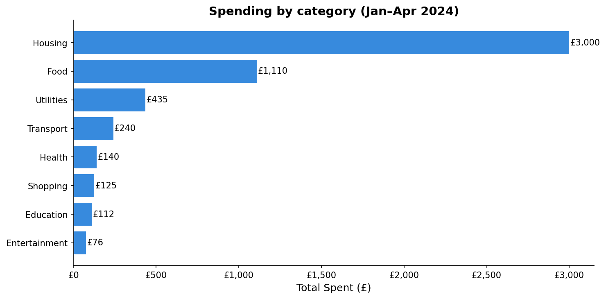
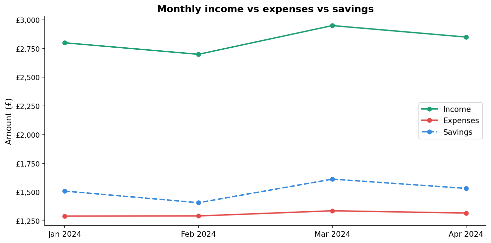

# Personal Budget Tracker & Analysis
**Tools:** Python · Pandas · Matplotlib  
**Dataset:** 59 simulated personal finance transactions (Jan–Apr 2024)

## Project overview
A personal finance analysis project that loads, cleans, and visualises
transaction data to uncover spending patterns and track savings rate
over time. Built as part of my data science portfolio, combining my
background in accounting and finance with Python data analysis skills.

## Key findings
- Housing is the largest expense category at £3,000 (57% of total spending)
- Average monthly savings rate which is ~52% consistently above the 20% benchmark
- March 2024 was the strongest month, driven by highest freelance income (£450)
- Food is the second largest category at £1,110 and thus a potential area to optimise

## Skills demonstrated
- Data loading and cleaning with Pandas
- Groupby aggregations and summary statistics
- Data visualisation with Matplotlib
- Personal finance domain knowledge (budgeting, savings rate, expense categorisation)

## Charts

## How to run
1. Clone this repository
2. Open `budget_tracker.ipynb` in Google Colab or Jupyter
3. Upload `transactions.csv` when prompted
4. Run all cells in order

## About me
MSc Data Science student at University of Roehampton with a background
in accounting and finance. Interested in applying data analytics within
financial services.
